### VirtualDOM的原理与实现

#####一、背景

我们都知道JavaScript很快，但是DOM很慢。为什么呢？这里需要对浏览器利用 HTML/CSS/JavaScript 等资源呈现出精彩的页面的过程进行简单说明。

- 浏览器在收到HTML文档后会对文档进行解析开始构建 `DOM ` (Document Object Model)树，注意：若在构建DOM树的过程中，当HTML解析器遇到一个script标记时，将立即阻塞DOM树的构建，将控制权交给js引擎，等js加载完成浏览器才会从中断的地方恢复对DOM树的构建。
- 在构建dom树的同时，浏览器开始解析CSS来构建 `CSSOM ` (CSS Object Model) 树，当遇到css文件时，先加载css文件，但是会阻塞Render树的构建。
- DOM树、CSSOM树合并构建 `Render Tree` (渲染树)，但并不是等于等DOM树和CSSOM树加载完成后才开始合并构建渲染树，三者的构建并无先后条件，亦非完全独立，而是会有交叉，并行构建。因此会形成一边加载，一边解析，一边渲染的工作现象。
- 有了Render树，浏览器已经能知道网页中有哪些节点，各个节点的css定义以及他们的从属关系，从而去计算出每个节点在屏幕中的位置。
- Render树和系节点显示位置坐标都有了，就会调用每个节点的 `paint` 方法，把他们绘制（重绘:repaint、重排:reflow）出来。

看了上面的过程我们知道，使用Javascript来操纵DOM，操作效率往往很低，由于DOM被表示为树结构，每次DOM中的某些内容都会发生变化，因此对DOM的更改非常快，但更改后的元素，并且它的子项必须经过 `Reflow / Layout` 阶段，然后浏览器必须重新绘制更改，这很慢的。因此，回流/重绘的次数越多，您的应用程序就越卡顿，但是JavaScript运行速度很快，Virtual DOM是放在JS和HTML中间的一个层。她可以通过新旧DOM对比，来获取对比之后的差异对象，然后有针对性的把差异部分应用到渲染的DOM树上，从而减少实际DOM操作，最终达到性能优化。

#####二、什么是Virtual DOM

总结一句话来说，Virtual DOM是对DOM的抽象，本质上是JavaScript对象，这个对象就是更加轻量级的对DOM的描述。

#####三、理解Virtual DOM

虚拟DOM，就是用JS对象结构的一种映射，比如下面的DOM树，如何用js对象表示呢？

```html
<ul class=”list”>
  <li>item 1</li>
  <li>item 2</li>
</ul>
```

```json
{
  type: "ul",   //节点类型
  props: {class: "list"}, //属性
  children:[ //子节点
    {
      type: "li",
      props: {},
      children: ["item 1"]
    },
    {
      type: "li",
      props: {},
      children: ["item 2"]
    }
  ]
}
```

可以注意到所有节点都是于这样一个对象：`{ type: '…', props: { … }, children: [ … ] }`，但是页面里面里面有大量的DOM节点的时候这种方式就比较麻烦，因此我们可以编写一个函数来生成帮助我们实现，也更容易理解这种结构。

```javascript
/**
 * generate Virtual DOM
 * @param {*} type 
 * @param {*} props 
 * @param  {...any} children 
 */
function vnode(type, props, ...children) {
  return {
    type,
    props,
    children
  }
}
```

此时我们可以这样表示我们的DOM树。

```javascript
vnode("ul", {class: "list"},
  vnode("li", {}, ["item 1"]),
  vnode("li", {}, ["item 2"]),
)
```

##### 四、createElement实现

我们用 `createElement` 生成一个DOM Tree的抽象—Virtual DOM Tree。

```javascript
/**
 * 
 * @param {*} tag  标签类型
 * @param {*} props 节点属性
 * @param  {...any} children 所有孩子
 */
function createElement(tag, props = {}, children) {
  let key;
  if (props.key) {
    key = props.key;
    delete props.key; //把props中key拿出来
  }
  return vnode(tag, key, props, children)
}
```

主流的框架均支持使用 JSX 的写法， JSX 最终会被 babel 编译为JavaScript 对象，用于来表示Virtual DOM，案例中的Virtual DOM是通过babel插件 [@babel/plugin-transform-react-jsx](https://babeljs.io/docs/en/next/babel-plugin-transform-react-jsx.html) 转换生成的。

#####五、Virtual DOM渲染成真实DOM

好了，现在我们已经将DOM树表示为简单的JS对象，并使用自己的结构。但我们需要从中创建一个真正的DOM，因为我们不能把JS对象表示添加到DOM中去。

下面就实现一个函数 `createDomElementFromVnode`，它接受一个虚拟的DOM节点`vnode`并返回一个真实的DOM节点 `$el`，我们注意到children它们中的每一个都是文本节点或元素，因此也是可以用 `createDomElementFromVnode` 函数创建的，是递归的。这个时候每个子元素就可以调用`createDomElementFromVnode`，然后将它们追加到元素中。

```javascript
/**
 * rendering virtual DOM into real DOM
 * @param {*} vnode 
 */
function createDomElementFromVnode(vnode) {
  let $el;
  if (vnode.type) {
    //tag
    $el = document.createElement(vnode.type);
  } else {
    //text
    $el = document.createTextNode(vnode);
  }
  if (vnode.props) {
    //props
    Object.keys(vnode.props).forEach(prop => {
      $el.setAttribute(prop, vnode.props[prop]);
    });
  }
  if (vnode.children && vnode.children.length) {
    vnode.children.forEach(child => {
      $el.appendChild(createDomElementFromVnode(child))
    })
  }
  return $el;
}
```

##### 六、Virtual DOM 对比更新

通过上面的方法我们可以将Virtual DOM变成一个真正的DOM，现在是时候考虑比较Virtual DOM树了。因此我们需要编写一个方法，它将比较两个Virtual DOM树（新旧树），只对发生变化的DOM进行必要的更改。如何让比较呢，需要处理下面的几种情况：

- 1、某个地方没有旧节点，因此我们需要添加子节点 `appendChild()`

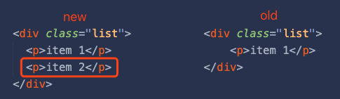

代码实现：

```javascript
/**
 * dom diff
 * @param {*} $parent 父级
 * @param {*} oldNode 老节点
 * @param {*} newNode 新节点
 */
function updateElement($parent, oldNode, newNode) {
  if (!oldNode) {
    //no oldNode apend newNode
    return $parent.appendChild(createDomElementFromVnode(newNode));
  }
}
```

demo运行：
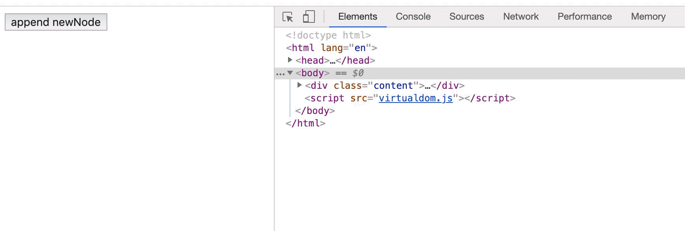

- 2、某个地方没有新节点，因此我们要删除老节点 `removeChild`

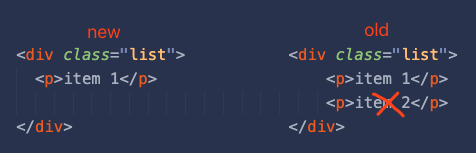

因此我们需要知道要删除的节点在父元素中的位置，可以通过 `$parent.childNodes[index]` 获取它的引用，其中index是节点在父元素中的位置。

代码实现：

```javascript
/**
 * dom diff
 * @param {*} $parent 父级
 * @param {*} oldNode 老节点
 * @param {*} newNode 新节点 
 * @param {*} index		索引
 */
function updateElement($parent, oldNode, newNode,index) {
  if (!newNode) {
    //no newNode remove oldNode
    return $parent.removeChild($parent.childNodes[index]);
  }
}
```
demo运行：
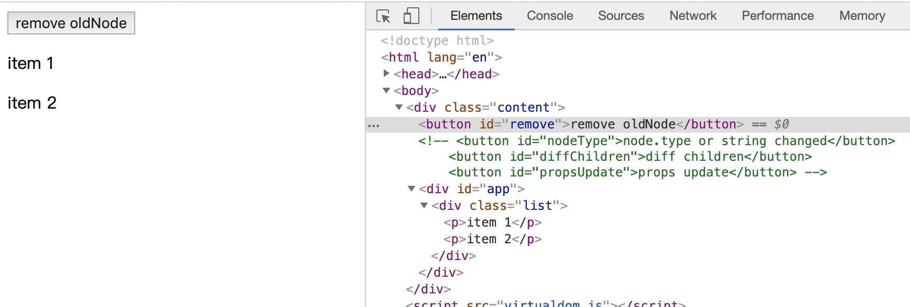

- 3、某个地方有一个不同的节点，表明节点已更改，因此我们需要替换子节点 `replaceChild`

  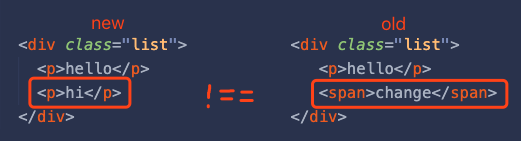

  首先，我们需要编写一个函数来比较两个节点（旧节点和新节点），并告诉我们节点是否真的发生了变化。

  代码实现：

  ```javascript
  /**
   * compare whether vnode has changed
   * @param {*} vnode1 
   * @param {*} vnode2 
   */
  function isVnodeChanged(vnode1, vnode2) {
    if (isPlainObject(vnode1) && isPlainObject(vnode2)) {
      return vnode1.type !== vnode2.type;
    }
    return vnode1 !== vnode2;
  }
  
  /**
   * dom diff
   * @param {*} $parent 父级
   * @param {*} oldNode 老节点
   * @param {*} newNode 新节点 
   * @param {*} index		索引
   */
  function updateElement($parent, oldNode, newNode,index) {
    if (isVnodeChanged(oldNode, newNode)) {
      //vnode.type or string changed 
      return $parent.replaceChild(createDomElementFromVnode(newNode), $parent.childNodes[index]);
    }
  }
  ```
  demo运行：
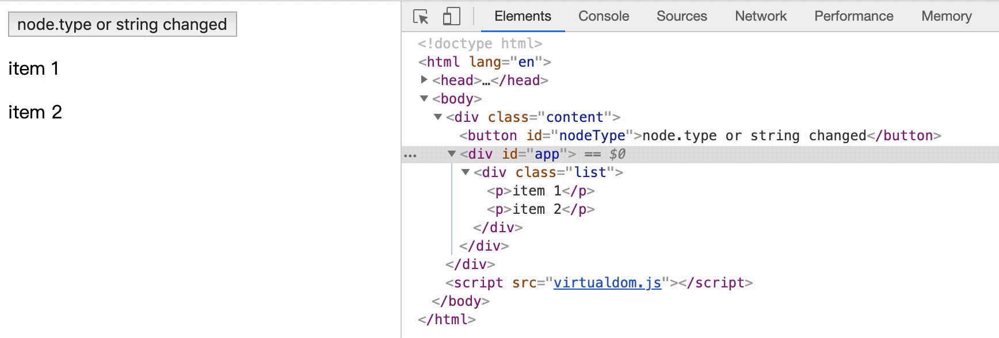

- 4、节点是相同的，所以我们需要深入研究并对比子节点

  我们应该检查这两个节点的每个子节点并对它们进行比较-实际上为每个节点调用 `updateElement`。是的，又是递归。

  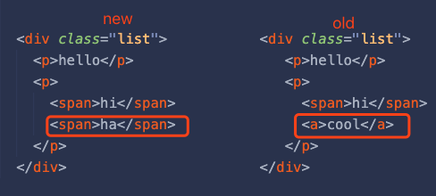

  代码实现：

  ```javascript
  /**
   * dom diff
   * @param {*} $parent 父级
   * @param {*} oldNode 老节点
   * @param {*} newNode 新节点 
   * @param {*} index		索引
   */
  function updateElement($parent, oldNode, newNode,index) {
    //Diff children
    if (newNode.type) {
      let maxLength = Math.max(oldNode.children.length, newNode.children.length);
      for (let i = 0; i < maxLength; i++) {
        updateElement($parent.childNodes[index], oldNode.children[i], newNode.children[i], i)
      }
    }
  }
  ```
  demo运行：
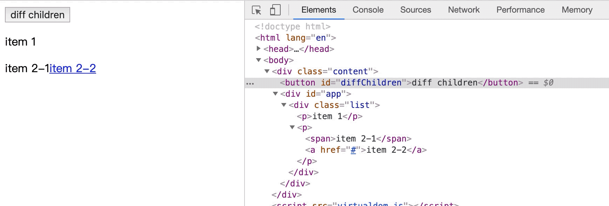

#####七、props 对比更新

现在编写一个函数，它将比较两个属性（oldProps和newProps）是否发生了变化，然后根据比较的结果来更新来修改实际的DOM节点属性值。

- 在新节点上没有具有此类名称的属性，因此我们需要将其删除

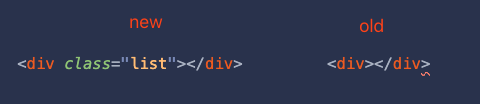

- 旧节点上没有具有此名称的属性，因此我们需要设置它

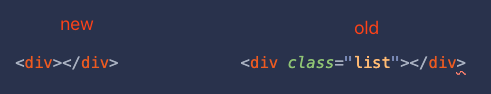

- 具有此类名称的属性同时存在于新节点和旧节点上-然后我们需要比较它们的值-如果它们不相等，我们需要用新节点的值再次设置该属性


综合实现代码如下：

```javascript
/**
 * compare whether object has changed
 * @param {*} obj1 
 * @param {*} obj2 
 */
function isObjChanged(obj1, obj2) {
  //data type
  if (isPlainObject(obj1) !== isPlainObject(obj2)) {
    return true;
  }
  //object
  if (isPlainObject(obj1)) {
    const obj1Keys = Object.keys(obj1);
    const obj2Keys = Object.keys(obj2);
    if (obj1Keys.length !== obj2Keys.length) {
      return true;
    }
    if (obj1Keys.length === 0) {
      return false;
    }
    for (let i = 0; i < obj1Keys.length; i++) {
      let key = obj1Keys[i];
      if (obj1[key] !== obj2[key]) {
        return true;
      }
    }
  }
  return false;
}
/**
 * dom diff
 * @param {*} $parent 父级
 * @param {*} oldNode 老节点
 * @param {*} newNode 新节点 
 * @param {*} index		索引
 */
function updateElement($parent, oldNode, newNode,index) {
  //props changed
  if (isObjChanged(oldNode.props, newNode.props)) {
    const oldProps = oldNode.props || {};
    const newProps = newNode.props || {};
    const oldPropsKeys = Object.keys(oldProps);
    const newPropsKeys = Object.keys(newProps);
    if (newPropsKeys.length === 0) {
      oldPropsKeys.forEach(prop => $currentNode.removeAttribute(prop))
    } else {
      const allKeys = new Set([...oldPropsKeys, ...newPropsKeys]);
      allKeys.forEach(prop => {
        //no oldprops, need to set newprops
        if (oldProps[prop] === undefined) {
          return $currentNode.setAttribute(prop, newProps[prop]);
        }
        //no newprops, need to remove oldprops
        if (newProps[prop] === undefined) {
          return $currentNode.removeAttribute(prop);
        }
        //compare whether the two props the same
        if (oldProps[prop] !== newProps[prop]) {
          return $currentNode.setAttribute(prop, newProps[prop]);
        }
      })
    }
  }
}
```

demo运行：

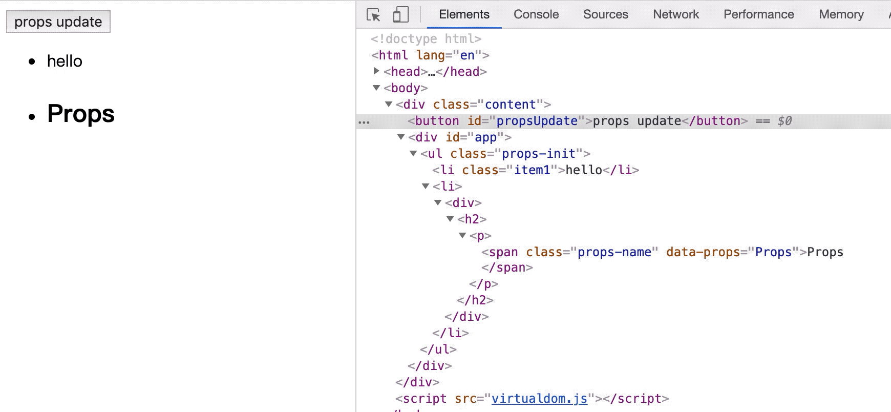

参考：

 \- [How to write your own Virtual DOM]( https://medium.com/@deathmood/how-to-write-your-own-virtual-dom-ee74acc13060)

