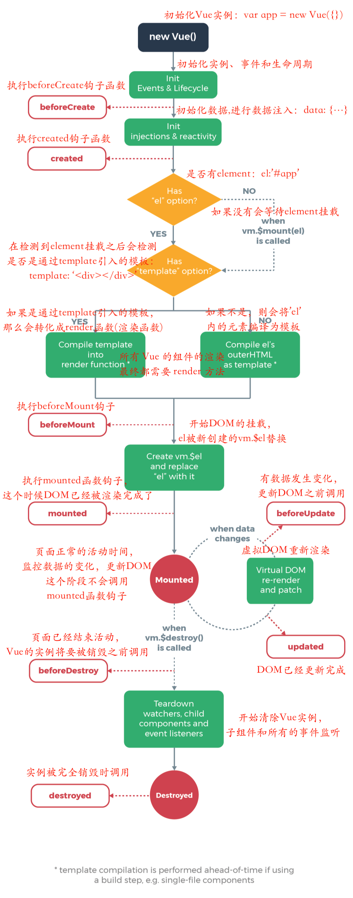
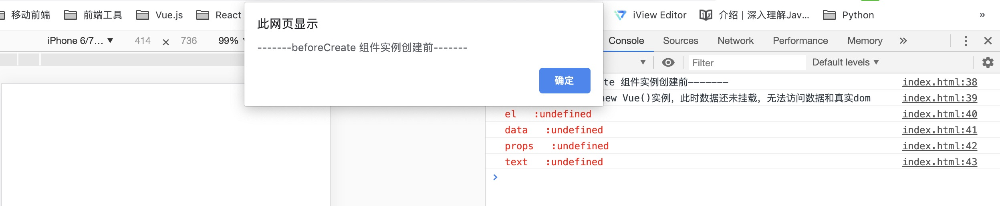
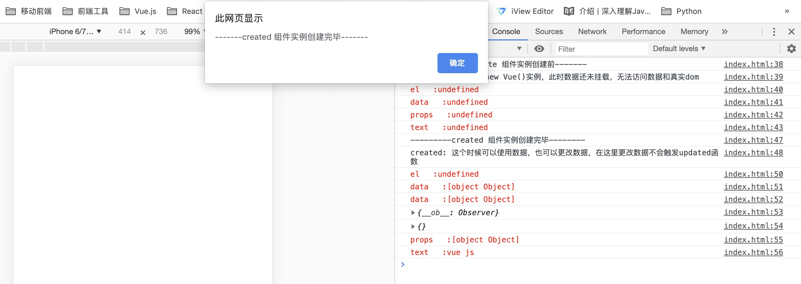
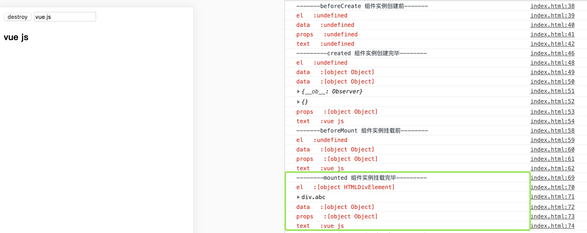
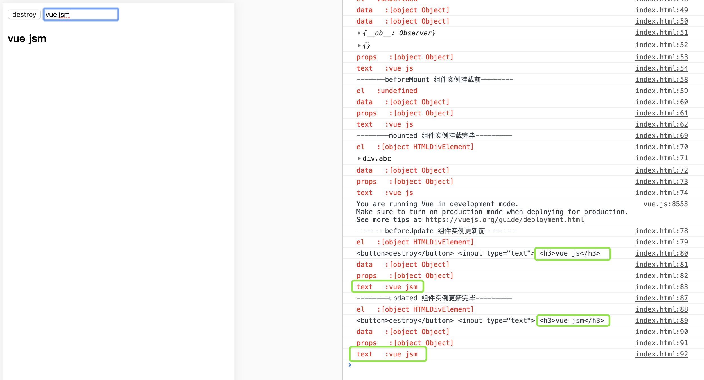

## Vue生命周期和钩子函数的理解

### 简介
Vue实例有一个完整的生命周期，也就是从开始创建、初始化数据、模板编译、挂载dom、渲染 -> 更新 -> 渲染、销毁等一系列的过程，我们称这是vue的生命周期，通俗点讲就是Vue实例从创建到销毁的整个过程。

可以看到vue在整个的生命周期中会有很多的**钩子函数**提供给我们在vue生命周期的不同时刻进行操作，先列出所有钩子函数（vue2.0+）：
* `beforeCreate`： el、data和props未被初始化
* `created`：完成了data和props初始化，el没有
* `beforeMount`：完成了el、data和props初始化，但是el还是{{text}}(`Virtual DOM`)
* `mounted`：完成挂载，el里面的{{text}}被赋值渲染
* `beforeUpdate`：可以监听到data的变化，但是view层没有被重新渲染，view层的数据还是没有变化的
* `updated`：view层此刻被重新渲染，数据更新
* `beforeDestroy`：实例销毁之前调用，此时实例仍可用，一般在这里做一些善后工作，如清除定时器的、解绑全局事件、销毁插件对象等...
* `destroyed`：实例销毁之后调用，调用后vue实例指示的所有内容会解除绑定、所有事件监听器会被移除以及所有子实例也会被销毁
### 生命周期探究

#### beforeCreate
刚刚new Vue()之后，这个时候Vue实例中的el、data，以及data中的text都为undefined，只是一个空壳子。

#### created
我们可以看到此时el还是undefind，而数据已经和data中的属性完成绑定（当data中的值发生变化的同时，视图也会发生变化），但是更改数据并不会触发updated函数。 
在这可有在渲染前倒数第二次更改数据的机会，不会触发其他钩子函数，一般可以用作初始数据获取。 
接下来开始找实例或者组件对应的模板，把模板编译为虚拟DOM(`Virtual DOM`)放入到render函数中准备渲染。

##### ⚠️注意：
  * 首先判断Vue实例有没有`el`选项，如果有则进行下面的编译，如果没有el选项，则会停止编译生命周期，也意味着停止了生命周期，直到该Vue实例上调用`vm.$mount(el)`
  * 如果有el，再判断是否有`template`参数，如果有，则把其当作模板编译成`render`函数，如果没有，则把`外部的html`作为模板编译。 template中的模板优先级高于outer HTML模板。
  * 在Vue实例中还有一个 `render` 函数，它以`createElement`作为参数，然后做渲染操作，我们还可以直接嵌入`JSX`。
  * 综合优先级： render函数选项  >  template  >  outer HTML
  * 综上来看，如果你要在created阶段进行dom操作，需要将操作都放在 `Vue.nextTick()` 的回调函数中（Vue.nextTick([callback, context])：在下次DOM更新循环结束之后执行延迟回调）， **因为created()钩子函数在执行的时候DOM并未进行渲染**。

#### beforeMount
此时注虚拟DOM已经创建完成，但是页面中内容还是vue中的占位符`{{text}}`，马上就要开始渲染，因此 **$el还是undefined**，这里也可以更改数据，不会触发updated函数。 
在这里有渲染前最后一次更改数据的机会，不会触发其他钩子函数

#### mounted
此时组件已经展现在页面上，数据和真实dom都处理好了，可以在这里做操作dom的一些事情了。 
在beforeMount和mounted钩子函数的生命周期中，可以看到此时是给Vue实例对象添加 `$el` 成员，并且替换掉挂载的dom元素，因为在beforeMount的时候el还是undefined。

#### beforeUpdate
更新前的状态（view层数据变化前，不是data中的数据改变前）：当我输入字符m更改了data之后，vue的虚拟dom机制会重新构建虚拟dom，与上次的虚拟dom树利用 `diff` 算法进行对比之后重新渲染，但是view层没有被重新渲染，view层的数据还是没有变化的。总之就是： **只有view上面的数据变化才会触发beforeUpdate和updated，仅仅是data中的数据改变并不能触发**

#### updated

数据更改已完成，dom也重新render完成。

#### beforeDestroy

销毁之前执行（this.$destroyed方法被调用的时候就会执行），一般在这里做一些善后工作，如：清除定时器、清除非指令绑定的事件等....

#### destroyed

执行 `this.$destroyed()`之后，组件的数据绑定、监听等都去掉了，只剩下dom空壳子了

