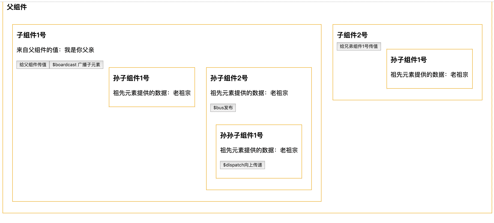
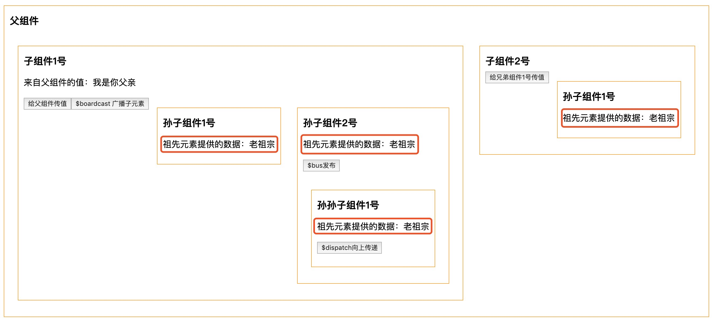
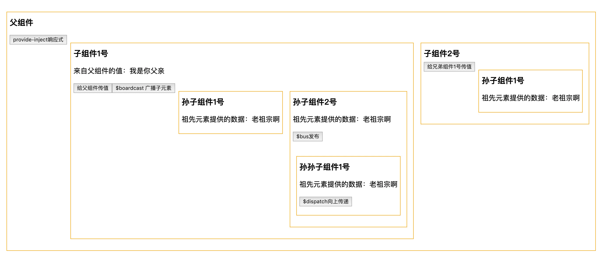
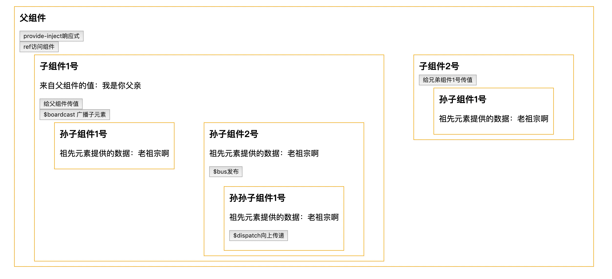
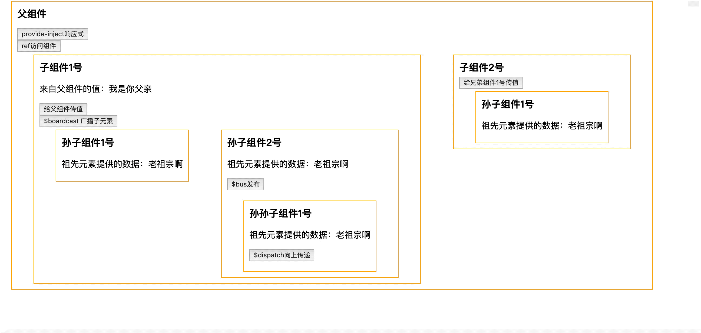
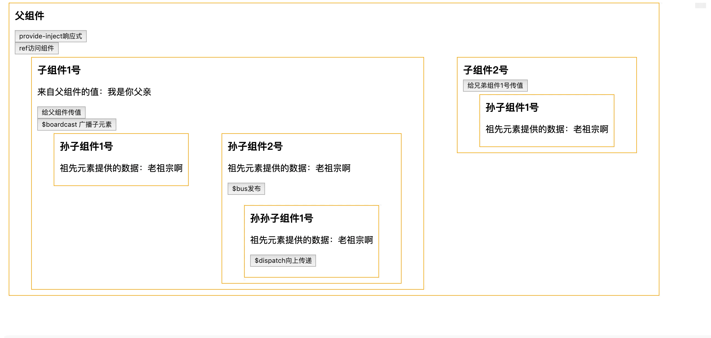

## Vue组件通信的姿势总结

### 一、props和$emit
#### 父组件向子组件通信 -- props
* 父组件引用子组件的时候利用 `v-bind` 去绑定 `titles`，传递给子组件（对应的就是 `title`）
* 子组件要创建 `props` 选项，注册传递的 `title` 的值，就可以直接拿到 `title` 这个值了

```html
<template>
  <div id="app">
    <h2>父组件</h2>
    <child1 :title="titles" :img-height="imgHeight"></child1>
  </div>
</template>

<script>
import Child1 from "@/components/Child1";
export default {
  name: "app",
  data() {
    return {
      titles: "我是你父亲",
      imgHeight: 100,
    };
  },
  components: { Child1 }
};
/*
  在父组件中的子组件需要通过 v-bind 来传递子组件中需要显示接收的数据
  title 第一个参数必须要与子组件的 props 同名
  titles 则是父组件需要向子组件传递的数据

*/
</script>
```
```html
<template>
  <div>
    <h2>子组件1号</h2>
    <p>来自父组件的值：{{title}}</p>
  </div>
</template>
<script>
export default {
  name: "Child1",
  //props: ["title", "imgHeight"],
  props:{
    title: {
      type: String,
      default: "",
      required: true
    },
    imgHeight:{
      type: [Numbber, String],
      default: 0
    }
  }
};
/*
  子组件需要显示的定义好需要从父组件接收哪些数据
*/
</script>
```
#### 总结：
* 使用 `props` 传递数据的作用域是孤立的，它是由父组件通过模板传递过来，想要接收父组件传来的数据，需要通过 `props选项` 来进行接收
* 子组件需要显示声明接收父组件传递来的数据的 `数量` 、`类型` 、`默认值`
* 简单的接收可以通过数组形式来接收
* 所有的 `props` 都使得其父子 `props` 之间形成了一个 **单向下行绑定**：父组件的 `props` 更新会向下流动到子组件，反过来则不行，这样防止子组件意外改变父组件的状态
* Vue传递数据时是基于 **数据单向流动**，子组件不能改变当前实例中的 `props` 任何属性，需要通知父组件改变相应的值，重新改变

#### 子组件向父组件通信 -- $emit(通过事件形式)
当点击按钮 “给父组件传值” 以后，子组件像父组件传值，`msg` 由原来的 “ ” 变为了 “子组件1号给父组件传值”
```html
<template>
  <div id="app">
    <h2>父组件</h2>
    <p>{{msg}}</p>
    <!-- 父组件监听子组件触发的 sendmsg 方法-->
    <child1 v-on:sendmsg="getmsg"></child1>
  </div>
</template>

<script>
import Child1 from "@/components/Child1";
export default {
  name: "app",
  data() {
    return {
      msg: "",
    };
  },
  components: { Child1 },
  methods:{
    getmsg(d){ //参数就是子组件传递过来的数据
      this.msg = d
    }
  }
};
</script>
```
```html
<template>
  <div>
    <h2>子组件1号</h2>
    <button @click="toParent">给父组件传值</button>
  </div>
</template>
<script>
export default {
  name: "Child1",
  methods:{
    //子组件通过 $emit 方法触发父组件定义好的函数 getmsg 从而将子组件中的数据传递给父组件 
    toParent(){
      this.$emit('sendmsg', '子组件1号给父组件传值')
    }
  }
};
</script>
```
#### 总结：
* 子组件通过events给父组件发送消息，自己的数据发送到父组件
### 二、$attrs和$listeners
多级组件嵌套需要传递数据时，通常使用的方法是通过vuex。但如果仅仅是传递数据，而不做中间处理，使用 vuex 处理，未免有点大材小用。为此Vue2.4 版本提供了另一种方法----$attrs/$listeners。

* `inheritAttrs`: 默认值true,继承所有的父组件属性（除props的特定绑定）作为普通的HTML特性应用在子组件的根元素上，如果你不希望组件的根元素继承特性设置inheritAttrs: false,但是class属性会继承 **（简单的说，inheritAttrs：true 继承除props之外的所有属性；inheritAttrs：false 只继承class属性）**
* `$attrs`: 继承所有的父组件属性（除了prop传递的属性、class 和 style ），一般用在子组件的子元素上
* `$listeners`: 它是一个对象，里面包含了作用在这个组件上的所有监听器，你就可以配合 v-on="$listeners" 将所有的事件监听器指向这个组件的某个特定的子元素。**（相当于子组件继承父组件的事件）**


### 三、$on和$emit (中央事件总线)
上面方式都是处理的父子组件之间的数据传递，那如果两个组件不是父子关系呢?比如兄弟组件。<br>
此时，我们可以用订阅发布模式，并且挂载到 `Vue.prototype` 之上，这种机制叫做 **总线机制（中央事件总线/事件中心）**，新建一个Vue事件bus对象，然后通过bus.$emit触发事件，bus.$on监听触发的事件，巧妙而轻量地实现了任何组件间的通信，包括父子、兄弟、跨级。下面演示兄弟组件的传值：
```js
//main.js
import Vue from 'vue';
//方案一：自己实现 Bus
class Bus{
  constructor(){
    this.callbacks = {}
  }
  //监听
  $on(name, fn){
    this.callbacks[name] = this.callbacks[name] || []
    this.callbacks[name].push(fn)
  }
  //触发
  $emit(name, args){
    if(this.callbacks[name]){
      //遍历所有的callbacks
      this.callbacks[name].forEach(cb => cb(args))
    }
  }
}
Vue.prototype.$bus = new Bus(); 
//方案二：Vue本身就是一个订阅发布的实现，我们偷个懒，把Bus这个类可以删掉，新建一个空的Vue实例就可以啦
Vue.prototype.$bus = new Vue(); 
//new一个空的Vue实例作为中央事件总线（事件中心），用他来触发和监听事件
```
```html
// Child1
<template>
  <div>
    <h2>子组件1号</h2>
    <p>{{name}}</p>
  </div>
</template>
<script>
export default {
  name: "Child1",
  data(){
    return{
      name: ""
    }
  },
  mounted(){
    this.$bus.$on('sendToChild1', name=>{
      this.name = '来自兄弟组件2号的值:' + name
    })
  }
};
</script>
```
```html
// Child2
<template>
  <div>
    <h2>子组件2号</h2>
    <button @click="toChild1">给兄弟组件1号传值</button>
  </div>
</template>
<script>
export default {
  name: "Child2",
  methods{
    toChild1(){
      this.$bus.$emit('sendToChild1', '我是从子组件2号传过来的')
    }
  }
};
</script>
```
效果：


### 四、provide和inject (祖先后代)
props一层层传递，爷爷给孙子还好，如果嵌套了五六层还这么写，那也未免太恶心了，Vue在2.2.0版本为我们提供了 `provide / inject`，这一对选项，需要一起配合使用，祖先组件中通过 `provide` 来提供变量，然后在子孙组件中通过 `inject` 来注入变量。不论子组件有多深，只要调用了inject那么就可以注入provide中的数据。而不是局限于只能从当前父组件的prop属性来获取数据，只要在祖先组件的生命周期内，子孙组件都可以调用。

```html
// App
<template>
  <div id="app">
    <h2>祖先组件</h2>
    <child1></child1>
  </div>
</template>

<script>
import Child1 from "@/components/Child1";
export default {
  name: "app",
  provide: {
    root: "老祖宗"
  },
  components: { Child1 },
};
</script>
```
```html
//Child1
<template>
  <div>
    <h2>子组件1号</h2>
    <p>祖先组件App提供的数据：{{root}}</p>
    <grand-child1></grand-child1>
  </div>
</template>
<script>
import GrandChild1 from "./GrandChild1";
export default {
  name: "Child1",
  inject: ["root"], //得到祖先组件传递过来的数据 
  components: { GrandChild1 }
};
</script>
```
```html
//GrandChild1
<template>
  <div>
    <h2>孙子组件1号</h2>
    <p>祖先组件App提供的数据：{{root}}</p>
  </div>
</template>
<script>
export default {
  name: "GrandChild1",
  inject: ["root"] //得到祖先组件传递过来的数据
};
</script>
```
运行结果：


#### 总结：
* provide 和 inject 主要为高阶插件或者组件库提供用例，并不推荐直接用于应用程序代码
* provide 和 inject 绑定并不是可响应式的，这是刻意为之的。然而，如果你传入了一个可监听对象，那么其**对象属性还是可响应的**。（因此，根组件中 `root` 变了的话，其子组件、孙组件中的 `root` 是不会变的），仍然是 `老祖宗`  [vue官网提示](https:cn.vuejs.org/v2/api/#provide-inject)
* provide 和 inject 如何实现响应式？<br>
1. 方案一：provide 祖先组件的实例，然后在子孙组件中注入依赖，这样就可以在子孙组件中直接修改祖先元素的实例的属性；<br>
2. 方案二：使用2.6最新API `Vue.observable` 优化响应式 provide(推荐)

先看第一种方案：
```html
// App
<template>
  <div id="app">
    <h2>祖先组件</h2>
    <button @click="changeRoot()">provide-inject实现响应式</button>
    <child1></child1>
  </div>
</template>

<script>
import Child1 from "@/components/Child1";
export default {
  name: "app",
  provide(){
    return {
      text: this //提供祖先元素的实例
    }
  },
  data(){
    return{
      root: "老祖宗啊"
    }
  },
  components: { Child1 },
  methods:{
    changeRoot(root){
      if(root){
        this.root = root
      }else{
        this.root = this.root === '老祖宗啊' ? '老祖宗变了' : '老祖宗啊'        
      }
    }
  }
};
</script>
```
```html
//Child1
<template>
  <div>
    <h2>子组件1号</h2>
    <p>祖先组件App提供的数据：{{text.root}}</p>
    <grand-child1></grand-child1>
  </div>
</template>
<script>
import GrandChild1 from "./GrandChild1";
export default {
  name: "Child1",
  inject:{
    text:{}
  },
  components: { GrandChild1 }
};
</script>
```
```html
//GrandChild1
<template>
  <div>
    <h2>孙子组件1号</h2>
    <p>祖先组件App提供的数据：{{root}}</p>
  </div>
</template>
<script>
export default {
  name: "GrandChild1",
  inject:{
    text:{}
  }
};
</script>
```
第二种方案：Vue.observable

```html
// App
<template>
  <div id="app">
    <h2>祖先组件</h2>
    <button @click="changeRoot()">provide-inject实现响应式</button>
    <child1></child1>
  </div>
</template>

<script>
import Vue from "vue";
import Child1 from "@/components/Child1";
export default {
  name: "app",
  provide(){
    this.text = Vue.observable({
      root: this.root
    })
    return {
      text: this.text
    }
  },
  data(){
    return{
      root: "老祖宗啊"
    }
  },
  components: { Child1 },
  methods:{
    changeRoot(root){
      if(root){
        this.text.root = root
      }else{
        this.text.root = this.text.root === '老祖宗啊' ? '老祖宗变了' : '老祖宗啊'        
      }
    }
  }
};
</script>
```
```html
//Child1
<template>
  <div>
    <h2>子组件1号</h2>
    <p>祖先组件App提供的数据：{{text.root}}</p>
    <grand-child1></grand-child1>
  </div>
</template>
<script>
import GrandChild1 from "./GrandChild1";
export default {
  name: "Child1",
  inject:{
    text:{}
  },
  components: { GrandChild1 }
};
</script>
```
```html
//GrandChild1
<template>
  <div>
    <h2>孙子组件1号</h2>
    <p>祖先组件App提供的数据：{{root}}</p>
  </div>
</template>
<script>
export default {
  name: "GrandChild1",
  inject:{
    text:{}
  }
};
</script>
```
运行结果：



### 五、$parent、$children和$refs

* `ref`: 被用来给元素或子组件注册引用信息: 就是绑定在普通元素上，则获取到这个DOM元素，若是绑定在组件上，则获取到的是这个组件的Vue实例vm。
* `$parent`、`$children`: 访问父子实例
```html
// App
<template>
  <div id="app">
    <h2>祖先组件</h2>
    <button @click="ref">ref访问组件</button>
    <child1 ref="child1"></child1>
  </div>
</template>

<script>
import Vue from "vue";
import Child1 from "@/components/Child1";
export default {
  name: "app",
  components: { Child1 },
  methods:{
    ref(){
      const child1 = this.$refs.child1;
      child1.say();
    }
  }
};
</script>
```
```html
//Child1
<template>
  <div><h2>子组件1号</h2></div>
</template>
<script>
export default {
  name: "Child1",
  methods:{
    say(){
      alert("我是子组件的say方法")
    }
  }
};
</script>
```
运行结果：



总结：这两种方法的弊端是，**无法在跨级或兄弟间通信**。

### 六、$dispatch和$broadcast

在上面第三条通信方式中我们知道provider和inject不是响应式的，如果子孙元素想通知祖先，就需要hack一下，Vue1中有`dispatch` 和 `boardcast`两个方法，但是vue2中被干掉了，我们自己可以模拟一下，其原理就是通过 `this.$parent` 和 `this.$children`递归查找父组件和子组件来触发事件。
很多开源软件都自己封装了这种方式，比如element ui，作为一个mixins去使用。[element的mixins源码](https://github.com/ElemeFE/element/blob/dev/src/mixins/emitter.js])、[《说说element组件库broadcast与dispatch》](https://github.com/answershuto/learnVue/blob/master/docs/%E8%AF%B4%E8%AF%B4element%E7%BB%84%E4%BB%B6%E5%BA%93broadcast%E4%B8%8Edispatch.MarkDown)
#### dispatch
递归向上查找获取$parent，向特定的父组件，触发事件
```html
<button @click="$dispatch('dispatch','哈喽 我是孙孙子组件1号')">dispatch向上传递</button>
```
```js
export defalut{
  methods:{
    $dispatch(eventName, data){
      let parent = this.$parent
      //查找父元素
      while(parent){
        if(parent){
          //父元素用$emit触发
          parent.$emit(eventName, data)
          // 递归查找父元素
          parent = parent.$parent
        }else{
          break
        }
      }
    }
  }
}
```
**注意：只是向上传递，并没有影响别的元素**<br>
运行结果：


#### boardcast
和dispatch类似，递归向下获取$children 来向所有子元素广播
```html
<button @click="$boardcast('boardcast','哈喽 我是子组件1号')">boardcast向下广播子元素</button>
```
```js
export defalut{
  function boardcast(eventName, data){
    this.$children.forEach(child=>{
      //子元素触发$emit
      child.$emit(eventName, data)
      //递归查找子元素调用 通过call修改this指向 child
      if(child.$children.length){
        boardcast.call(child, eventName, data)
      }
    })
  }
  methods:{
    $boardcast(eventName, data){
      boardcast.call(this, eventName, data)
    }
  }
}
```
运行结果：



但是这样有个弊端就是需要自己组件内部定理dispatch和boardcast太烦了，因此我们挂载到Vue的原型链上，或者你也可以像 element ui 一样封装作为一个mixins使用。
```js
//main.js
//$dispatch 向上传递
Vue.prototype.$dispatch = function (eventName, data) {
  let parent = this.$parent;
  //向上查找父元素
  while (parent) {
    if (parent) {
      //父元素 用$emit触发
      parent.$emit(eventName, data);
      //递归查找父元素
      parent = parent.$parent;
    } else {
      break;
    }
  }
}
//$boardcast  向下广播
Vue.prototype.$boardcast = function (eventName, data) {
  boardcast.call(this, eventName, data);
}
function boardcast(eventName, data) {
  this.$children.forEach(child => {
    //子元素 触发$emit（$emit就是通知自己，之所以可以通知父元素，是因为父元素传递了一个函数给自己）
    child.$emit(eventName, data);
    //递归通知所有子元素
    if (child.$children.length) {
      boardcast.call(child, eventName, data);
    }
  });
}
```

## 参考文章
 * [8种vue组件通信方式详细解析实例](http://developer.51cto.com/art/201904/594754.htm)
 * [vue组件间通信六种方式（完整版）](https://github.com/ljianshu/Blog/issues/66)
 * [vue组件通信全揭秘(共7章)](https://juejin.im/post/5bd97e7c6fb9a022852a71cf)